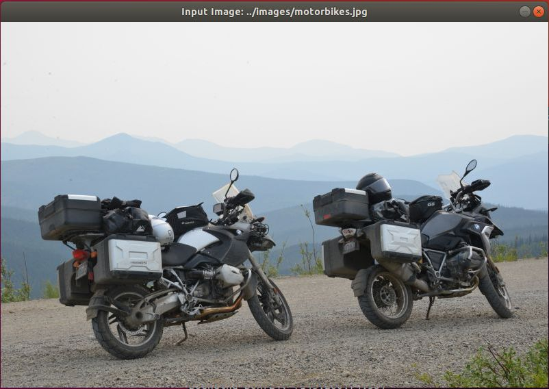
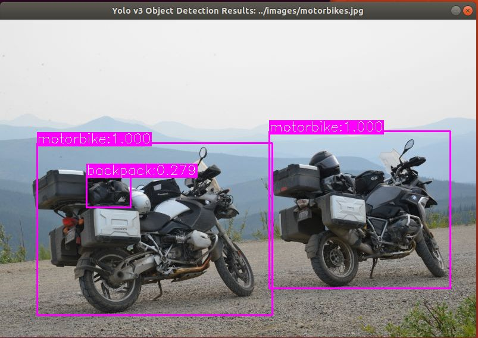
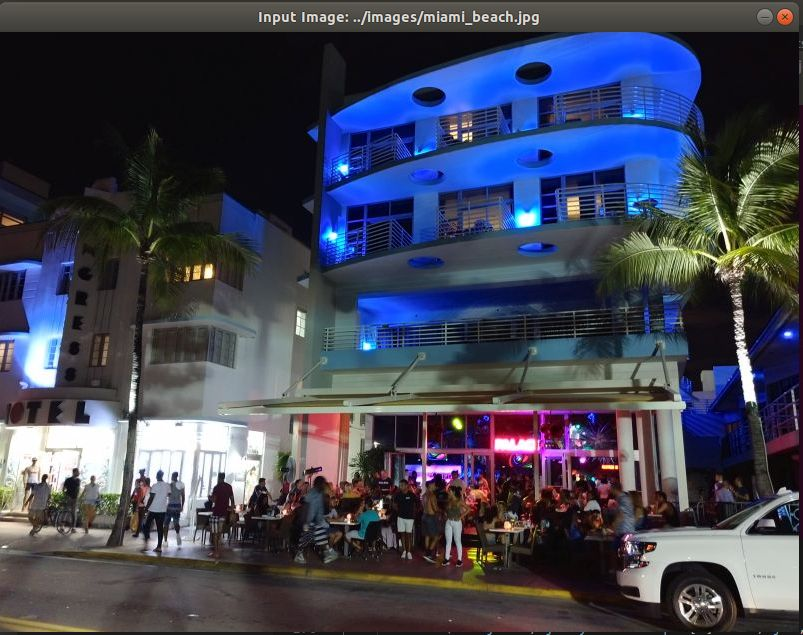
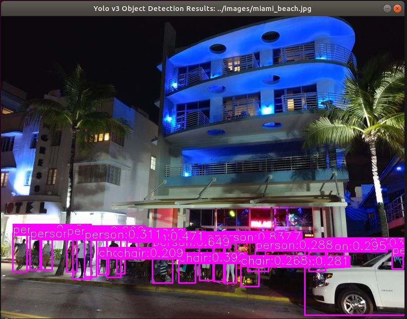

# ML_Yolov3_Object_Detector

Object detector inferencing implementation utilizing Yolov3 network trained with the COCO dataset.
For simplicity, this implementation utilizes OpenCV backend and runs on CPU only. 
It displays the original image and then the results with detected classes with bounding boxes and confidence levels.

## Usage

`yolov3_object_detector <input_image_file>`

## Notes
- Due to their large size, this repo does not contain trained yolo v3 weights.  
Pre-trained weights for the COCO dataset (https://cocodataset.org/) can be downloaded from https://pjreddie.com/media/files/yolov3.weights 
- Place the downloaded weights file as  `yolov3/yolov3.weights`

## Dependencies
- OpenCV
- Darknet
- Boost

## Examples

